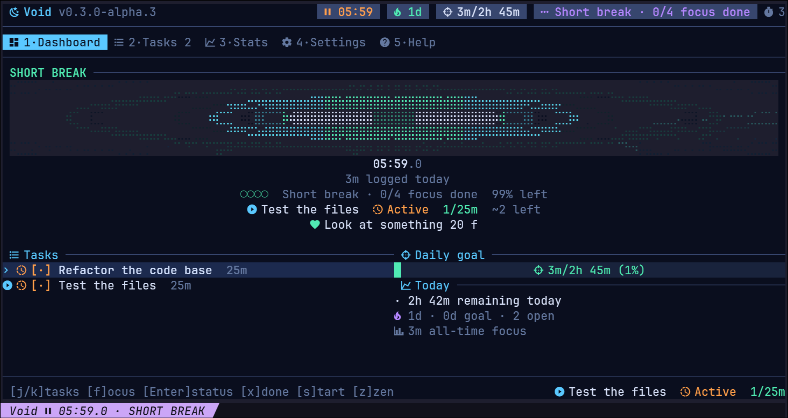
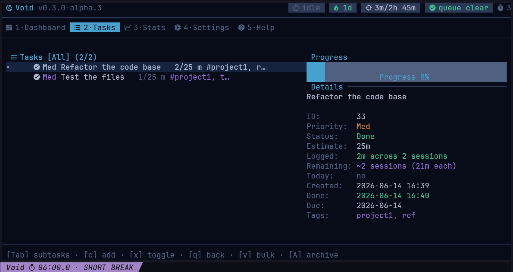
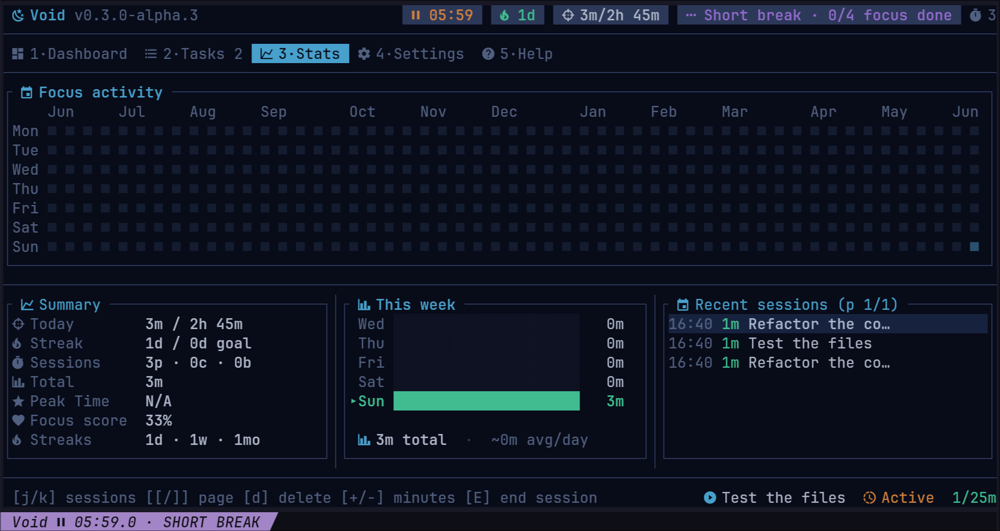

[](https://github.com/p6laris/Void/releases)
[](LICENSE)
[](https://www.rust-lang.org/)
[](https://crates.io/crates/void-focus)
[](https://github.com/p6laris/Void/actions/workflows/ci.yml)

# Void


Void is a simple, no-nonsense terminal focus timer and task manager. Keyboard-driven, fast, and completely offline.

---

## 📸 Look & Feel

**Dashboard** — Your current timer, active task, and daily queue.


**Tasks** — Priorities, tags, subtasks, and quick filtering.


**Stats** — Track your focus time, streaks, and recent activity.


---

## ✨ What's inside?

- **Pomodoro Timer**: Classic focus, short break, and long break intervals. 
- **Task Queue**: Keep track of what you're working on. Add tags, priorities, estimates, and subtasks.
- **Zen Mode**: Hide the noise. Shows only the timer and your current task for deep focus.
- **Stats & History**: Look back at your weekly charts, daily streaks, and everything you've completed.
- **Themes**: Switch between dark, light, and a few custom color palettes built right in.
- **Offline First**: Your data is yours. Everything lives in a standard SQLite database on your machine. No cloud accounts, no tracking.

---

## 📦 Install

### Cargo (Recommended)
If you have Rust installed, just run:
```bash
cargo install void-focus
```

### Homebrew (macOS / Linux)
```bash
brew tap p6laris/tap
brew install void
```

### Winget (Windows)
```powershell
winget install p6laris.Void
```

### Binaries
You can also grab pre-compiled binaries for macOS, Linux, and Windows straight from the [Releases](https://github.com/p6laris/Void/releases) page.

---

## ⌨️ How to use it

Press `5` in the app to open the Help menu anytime.

**The basics:**
* `Tab` or `1-5`: Switch views
* `q` or `Esc`: Quit (everything saves automatically)
* `Space`: Start/Resume timer
* `p`: Pause timer
* `a`: Add a new task
* `/`: Search tasks

Everything is stored locally in `~/.local/share/void/void.db` (or your OS equivalent). No cloud, no tracking.

---

## 🛠 Development

Want to hack on it?
```bash
git clone https://github.com/p6laris/Void.git
cd Void
cargo run
```

Before submitting a pull request, please ensure the code is formatted and passes all lints:
```bash
cargo fmt
cargo clippy -- -D warnings
```

## 📄 License
MIT License. See [LICENSE](LICENSE).
