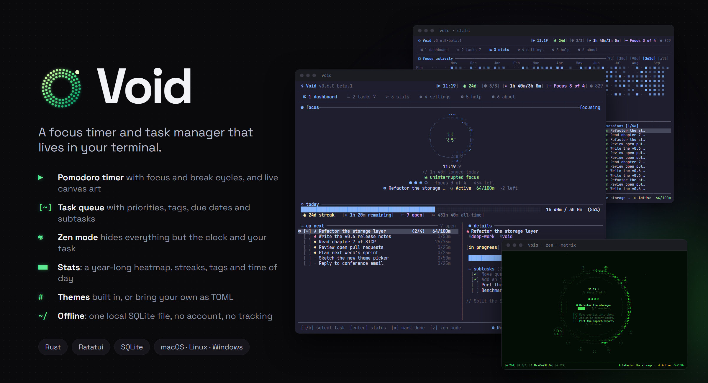
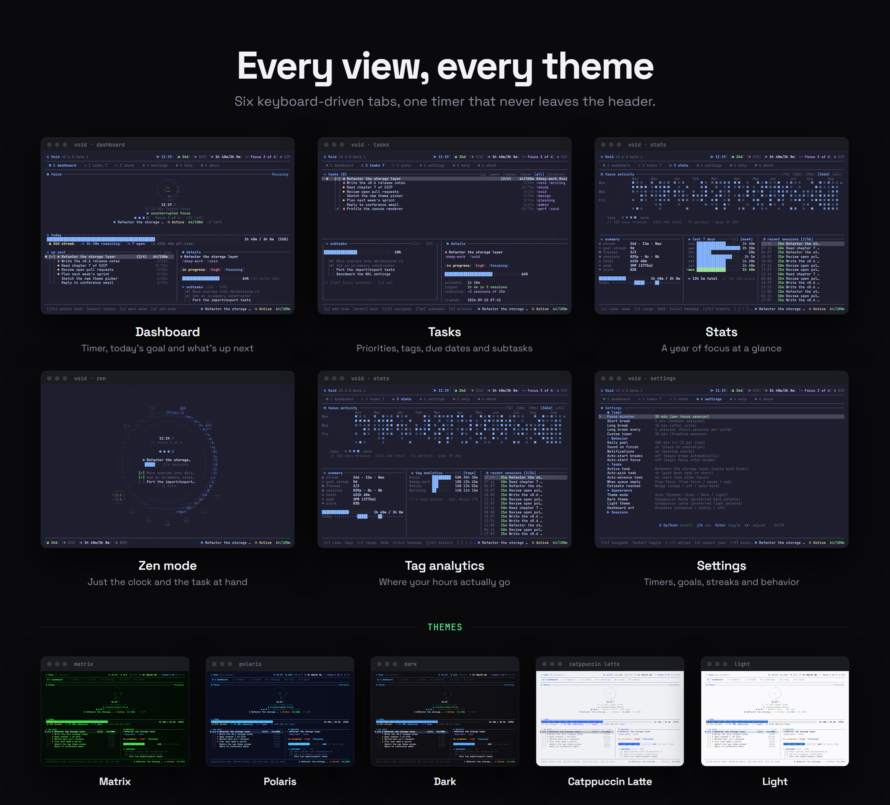

[](LICENSE)
[](https://crates.io/crates/void-focus)
[](https://ratatui.rs/)

# Void

A focus timer and task manager that lives in your terminal. Void runs Pomodoro-style focus and
break cycles, keeps a queue of what you're working on, and shows where your time went. It's
keyboard-driven and fast, and it works completely offline.





## Features

**Timer**
- Focus, short break and long break intervals, plus a custom timer and saved presets.
- Animated canvas art on the dashboard, or a static version, or none at all.
- A daily goal, with day, week and month streaks and streak freezes for the days you miss.
- Desktop notifications and a sound when a session ends.

**Tasks**
- Priorities, tags, due dates, estimates and subtasks.
- Filter by status or tag, search with `/`, and edit several tasks at once in bulk mode.
- Void can pick the next task for you and move on when you finish one.
- Old finished tasks are archived automatically.

**Zen mode**
- Hides everything except the timer and the task you're on. Press `z` on the dashboard.

**Stats**
- A year-long focus heatmap, with the sessions for any day you select.
- Your last 7 days, tag analytics, and focus by weekday and time of day.
- A paged history of every session.

**Everywhere**
- Built-in themes (Catppuccin Mocha and Latte, Matrix, Polaris, Dark and Light), plus your own in TOML.
- Nerd Font icons, with plain ASCII on terminals that can't show them. Set `VOID_ICONS=ascii` or
  `VOID_ICONS=nerd` to choose.
- Everything lives in one SQLite file on your machine. No account, no cloud, no tracking.

## Install

### Cargo (recommended)

```bash
cargo install void-focus
```

### Homebrew (macOS / Linux)

```bash
brew tap p6laris/tap
brew install void
```

### Winget (Windows)

Coming soon: Void is waiting to be accepted into winget. Once it is, you'll be able to run:

```powershell
winget install p6laris.Void
```

Until then, use Cargo or the Windows zip from the [Releases](https://github.com/p6laris/Void/releases)
page.

### Binaries

Pre-compiled binaries for macOS, Linux and Windows are on the
[Releases](https://github.com/p6laris/Void/releases) page.

## Usage

Run `void` to open the app. Press `?` (or `5`, or `h`) at any time for the full list of keys.

| Key | Action |
| --- | --- |
| `1`–`6` | Switch tabs (`Tab` also works, except on Tasks and About where it moves focus) |
| `Space` | Start or resume the timer |
| `p` | Pause (on the Tasks tab: cycle the selected task's priority) |
| `n` | Skip to the next session (logs the time if at least a minute has passed) |
| `e` | End the session, logging the time so far |
| `z` | Zen mode (`1`–`9` tick off the active task's subtasks) |
| `a` | Add a task |
| `/` | Search tasks |
| `T` | Filter tasks by tag |
| `A` | Archive a task (restores it in the Archive filter) |
| `Ctrl-S` | Export a backup |
| `Esc` | Back to the dashboard, or leave Zen mode; quits from the dashboard |
| `q` or `Ctrl-C` | Quit (`q` asks first if a session is running; `Ctrl-C` saves it) |

You can also manage tasks without opening the app:

```bash
void add "Write the release notes" --due tomorrow --tags writing,void
void list
void done 3
void start 3
```

`void help` lists every command and `void --version` prints the version. Commands exit with a
non-zero status when they fail, so they're safe to use in scripts. Your data is stored in `~/.local/share/void/void.db`, or your OS
equivalent.

## Custom themes

Void loads themes from TOML files. Drop a `.toml` file into your themes directory:

- **Linux:** `~/.config/void/themes/`
- **macOS:** `~/Library/Application Support/void/themes/`
- **Windows:** `%APPDATA%\void\themes\`

Here's an example `cyber.toml`:

```toml
name = "Cyberpunk"

[palette]
neon_pink = "#FF00FF"
neon_blue = "#00FFFF"
dark_bg = "#0B0B1A"
gray = "#333333"

[tokens]
bg = "dark_bg"
text = "#FFFFFF"
dim = "gray"
accent = "neon_pink"
on_accent = "#000000"
success = "neon_blue"
warning = "#FFFF00"
error = "#FF0033"
info = "neon_blue"
progress_dim = "gray"
task_track = "gray"
panel = "dark_bg"
panel_border = "neon_pink"
select_bg = "gray"
select_fg = "neon_pink"
active_bg = "gray"
active_fg = "neon_blue"
```

The [Catppuccin themes](themes/) that ship with Void are good starting points.

## Import and export

### Export

Export your tasks, settings and focus history to a JSON file at any time.

From the command line:

```bash
# Export to the default location
void --export

# Export to a specific file
void --export ~/my_backup.json

# Export your sessions as CSV
void --export-csv ~/sessions.csv
```

From the app, press `Ctrl-S` anywhere, or `e` in the Settings tab.

### Import

To restore a backup or move your data to a new machine:

```bash
void --import ~/my_backup.json
```

> **Heads up:** importing replaces your current data with the contents of the backup. Void asks
> you to confirm before anything changes; add `--yes` to skip the prompt in scripts.

Importing a `.csv` file adds its sessions to your history instead of replacing anything. Rows that
were already imported are skipped.

## Development

```bash
git clone https://github.com/p6laris/Void.git
cd Void
cargo run
```

Before opening a pull request, format the code and make sure it passes the lints:

```bash
cargo fmt
cargo clippy --all-targets -- -D warnings
```

See [CONTRIBUTING.md](CONTRIBUTING.md) for more.

## License

MIT. See [LICENSE](LICENSE).
